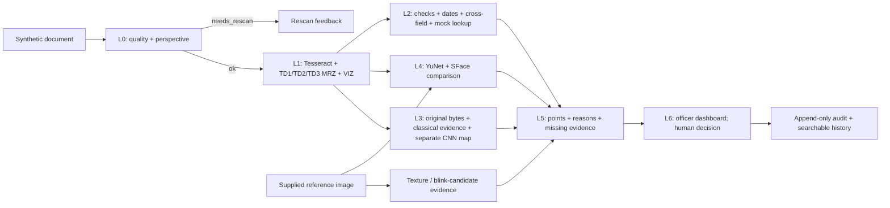

# AI-Based Fake Identity & Document Screening — Synthetic Demo

**Phases 1–6 implemented:** L0 → L1 → parallel L2/L3/L4 → explainable L5 → L6 dashboard + audit, with synthetic evaluation.
Classical tampering, synthetic U-Net, face/liveness evidence, weighted policy aur officer review ready.
Yeh hackathon prototype sirf fictional/mock documents ke liye hai. `status: ok`
ka matlab processing complete hai; genuine document ya approval ka certificate nahi.
React dashboard, searchable history aur transactional hash-chain audit available hain.
Docker configuration validated hai; local Docker engine unavailable hone se container run unverified hai.
Dashboard setup aur verification: [Phase 5 guide](docs/phase5.md).
Final [Phase 6 handoff](docs/phase6.md), [measured evaluation](reports/phase6/evaluation.md),
[one-page overview](output/pdf/solution_overview.pdf), [PPT outline](docs/presentation_outline.md)
aur [five-minute walkthrough](docs/demo_walkthrough.md) ready hain.
Deployment follow-up: [smoke/persistence guide](docs/deployment_verification.md).
Native restart persistence verified hai; Docker startup ka concrete host socket error
[verification report](reports/deployment/summary.md) mein documented hai.
Online deployment ke liye Vercel frontend ko Docker backend se connect karein:
[cloud deployment guide](docs/cloud_deployment.md). Vercel-only runtime degraded preview
hai: Tesseract OCR unavailable aur SQLite history temporary ho sakti hai.
L3 install, commands, results aur limitations: [Phase 3 guide](docs/phase3.md).
Integrated API, scoring policy aur demo: [Phase 4 guide](docs/phase4.md).



## Setup — Windows PowerShell

### Complete dashboard quick start

Existing prepared workspace mein:

```powershell
.\.venv\Scripts\python.exe scripts/bootstrap.py
cd frontend
npm ci
npm run build
cd ..
.\.venv\Scripts\python.exe -m uvicorn app.main:app --host 127.0.0.1 --port 8000
```

Open [Sentinel dashboard](http://127.0.0.1:8000), load a synthetic case, then analyze.
Built frontend must exist before starting the server. First model call may be slow.

Fresh clone ke liye below foundation setup, Phase 2 face weights aur Phase 3 CPU
PyTorch/checkpoint setup follow karein. Weights and generated datasets are git-ignored;
they are downloadable (face) or reproducible (synthetic tamper training).
Optional detectors missing hon to output unavailable hoga. Evaluation prerequisites
aur complete reproduction commands [Phase 6 guide](docs/phase6.md) mein hain.

### Foundation and standalone Phase 1

Project root mein commands run karein. Python 3.10+ required hai.

```powershell
python -m venv .venv
.\.venv\Scripts\python.exe -m pip install -e "./backend[dev]"
powershell -NoProfile -ExecutionPolicy Bypass -File scripts/install_ocr_windows.ps1
.\.venv\Scripts\python.exe scripts/generate_mock_documents.py
.\.venv\Scripts\python.exe scripts/seed_mock_database.py
.\.venv\Scripts\python.exe -m uvicorn app.main:app --host 127.0.0.1 --port 8000
```

Tesseract already installed ho to installer skip karke `.env.example` ko `.env`
copy karein aur `TESSERACT_CMD` set karein. Portable installer `.tools/` mein
Micromamba/conda-forge runtime rakhta hai; system PATH/shell profile change nahi karta.
Is setup mein Tesseract package aur dependencies ka download ~217 MB tha.

Linux par system packages `tesseract-ocr`, `tesseract-ocr-eng` aur
`fonts-dejavu-core` install karein; venv interpreter `.venv/bin/python` hoga.
Linux runtime abhi is Windows development session mein test nahi hua hai.

Installed Python dependency snapshot: [backend/requirements-lock.txt](backend/requirements-lock.txt).
Snapshot Windows/Python 3.11 environment ka hai; other Python versions ke liye
`pyproject.toml` constraints se compatible packages resolve karein.
Same Python versions reproduce karne ke liye pehle snapshot install karein,
phir `pip install --no-deps -e ./backend` run karein.

API explorer: [localhost Swagger UI](http://127.0.0.1:8000/docs).
Service ko loopback par hi run karein; officer labels local aur unverified hain. Authentication implemented nahi hai.

## Run a complete Phase 1 demo

```powershell
.\.venv\Scripts\python.exe scripts/demo_phase1.py data/synthetic/genuine.png
.\.venv\Scripts\python.exe scripts/demo_phase1.py data/synthetic/dob_altered.png
.\.venv\Scripts\python.exe scripts/verify_phase1.py
```

Standalone demo image ko real OCR se read karta hai; ground-truth JSON pipeline
ko feed nahi hota. `verify_phase1.py` output ko ground truth se compare karta hai.
Fixed demo date `2026-10-03` hai. CLI mein `--reference-date YYYY-MM-DD` se change karein.

```powershell
curl.exe -X POST http://127.0.0.1:8000/api/v1/phase1/analyze -F "document=@data/synthetic/dob_altered.png" -F "reference_date=2026-10-03"
```

Eight generated fixtures: clean, DOB altered, checksum failed, blurred,
perspective capture, expired, mock-blacklisted aur previously seen.
Clean ka matlab generated untampered sample hai, authenticity verification nahi.
Executed checks, timings aur known errors: [Phase 1 verification](reports/phase1_summary.md).

## Phase 2: face verification

```powershell
.\.venv\Scripts\python.exe -m pip install -e "./backend[dev,face]"
.\.venv\Scripts\python.exe scripts/download_face_models.py
.\.venv\Scripts\python.exe scripts/generate_face_fixtures.py
.\.venv\Scripts\python.exe scripts/demo_phase2.py data/synthetic_faces/a_document.png data/synthetic_faces/a_live.png
.\.venv\Scripts\python.exe scripts/verify_phase2.py
```

CPU baseline YuNet/SFace use karta hai. `config/face_thresholds.yaml` ka 0.60 threshold
small synthetic development pair ke liye chosen hai; calibrated FAR/FRR claim nahi hai.
Original 0.363 reference threshold ka false match report mein preserved hai.
No/multiple/poor-quality face par result `undetermined` hoga. Still image se live-person
verification nahi hoti; liveness heuristics `inconclusive`/`suspicious` evidence deti hain.

Complete [Phase 2 guide and API](docs/phase2.md), [measured report](reports/phase2_smoke.json)
aur [generated asset provenance](docs/face_asset_provenance.md) available hain.
Checks aur error analysis: [Phase 2 verification](reports/phase2_summary.md).
FAISS duplicate demo sirf two fixed generated identities ke liye hai; external
enrollment/search nahi hai. Full L2/L3/L4 orchestration Phase 4 integrated API mein available hai.

## Tests

```powershell
.\.venv\Scripts\python.exe -m pytest backend/tests -q
.\.venv\Scripts\python.exe -m ruff check backend scripts --config backend/pyproject.toml
.\.venv\Scripts\python.exe -m ruff format --check backend scripts --config backend/pyproject.toml
```

Tesseract unavailable ho to actual OCR tests skip hote hain; engine-missing test
phir bhi `unavailable` response verify karta hai. Unit tests mein known ICAO
examples, all three layouts, invalid checksums, corrections, date ambiguity,
mock lookup aur quality gates covered hain. REST tests large uploads ko memory
mein rakhne aur failed-quality scans par OCR skip karne ko verify karte hain.

## Module entry points

| Layer | Standalone function | REST |
|---|---|---|
| L0 | `app.layers.l0_capture.preprocess.preprocess(image)` | `POST /api/v1/capture/preprocess` |
| L1 | `app.layers.l1_ocr.engine.extract_ocr(image)` | `POST /api/v1/ocr/extract` |
| MRZ parser | `app.layers.l1_ocr.mrz.parse_mrz(lines)` | `POST /api/v1/ocr/parse-mrz` |
| L2 | `app.layers.l2_validation.checks.validate_document(request)` | `POST /api/v1/validation/check` |
| Pipeline | `app.pipeline.analyze_phase1(bytes, reference_date)` | `POST /api/v1/phase1/analyze` |
| L4 verification | `app.layers.l4_face.verification.verify_faces(document, live)` | `POST /api/v1/faces/verify` |
| L4 liveness | `app.layers.l4_face.liveness.evaluate_liveness(frames, timestamps_ms)` | `POST /api/v1/faces/liveness` |

`image` OpenCV BGR NumPy array hai. Full API details: [docs/api_contract.md](docs/api_contract.md).
Layer-wise explanation: [docs/phase1.md](docs/phase1.md).

## Limits jo judges ko clearly batane hain

- L0 classification geometry hint hai; L1 English keywords se refine karta hai.
  Trained multiclass classifier nahi hai. Upright/already-oriented capture expected hai.
- VIZ extractor English same-line labels support karta hai. Arbitrary country layouts,
  multilingual documents aur next-line labels ke liye additional adapters chahiye.
- MRZ standard TD1/TD2/TD3 parse hoti hai. Extended numbers explicitly unsupported;
  visa MRV-A/MRV-B ko passport MRZ samajhkar parse nahi kiya jata. Visa VIZ supported hai.
- O/0, I/1, B/8 position-constrained corrections preserved hain. Alphanumeric document
  numbers ko checksum pass karane ke liye guess nahi kiya jata.
- Tesseract word/line confidence proxy per field expose hota hai. MRZ confidence zero
  bhi aa sakta hai; yeh calibrated correctness probability nahi hai.
- Saturated white paper ko glare heuristic flag kar sakti hai; blur/brightness
  thresholds device-specific calibration maangte hain.
- Country list ISO codes plus configured special/example codes hai; passport regex
  authoritative global registry nahi hai. Sirf fictional UTO-specific policy configured hai.
- Check-digit failure review signal hai; tampering proof ya automatic rejection nahi.
- SQLite blacklist fictional hai. Previous sighting ko fraud nahi mana jata.
- Synthetic fixtures development mein use hue hain; inke results held-out benchmark
  ya real-world accuracy nahi hain. Phase 6 ki scoped evaluation available hai.

## Measured synthetic results

26 TD3 images: VIZ **150/156 (96.15%)**, MRZ **141/156 (90.38%)** exact fields;
valid-document check-digit pass **22/25**. Frozen CNN on 100 fresh procedural images:
precision **94.81%**, recall **91.25%**, F1 **92.99%**, TN/FP/FN/TP = **16/4/7/73**.
Copy-move IoU **0.179** is weak; classical recall is **1.25%** at the fixed demo threshold.
These new source groups share layouts/attack families with training.

Two-identity face ROC is illustrative and not a calibrated biometric benchmark.
Controlled CPU pipeline median **4.01 s**, descriptive p95 **5.57 s**, n=6 warm calls;
cold **12.51 s**. These exclude HTTP/audit/UI. Phase 5 browser timing was slower.
See [full protocol, charts and error analysis](reports/phase6/evaluation.md).

```powershell
.\.venv\Scripts\python.exe scripts/demo_phase6.py --prepare-only
.\.venv\Scripts\python.exe scripts/demo_phase6.py --scenario photo_replaced
```

Project layout: `backend/app/layers/` L0–L5, `backend/app/api/` REST,
`backend/app/storage/` lookup + audit, `frontend/src/` L6 React,
`config/` frozen thresholds/policy/evaluation protocol, `models/` manifests + local weights,
`scripts/` generators/train/evaluate/demo, `reports/` measured evidence,
`docs/` guides/demo/outline, `output/pdf/` one-page overview.

## Privacy

Uploaded/preprocessed images server disk par persist nahi hoti. Multipart uploads
bounded memory mein rehte hain; Tesseract ko image stdin se bheji jati hai. Explicit
generator command synthetic fixtures disk par banata hai. JSON report saving explicit
CLI option hai. [Privacy design](docs/privacy.md) mein retention aur DPDP-style
data-minimization considerations documented hain; legal compliance claim nahi hai.
L6 ka explicit `POST /api/v1/scans/analyze` scores, hashes aur review metadata store
karta hai; purana `/screening/analyze` transient hai. Free-text officer notes persist
hoti hain: notes mein personal identifiers na likhein.

## References

- [ICAO publications / Doc 9303](https://www.icao.int/icao-trip/publications): MRZ specification family.
- [Tesseract documentation](https://tesseract-ocr.github.io/tessdoc/): OCR runtime and configuration.
- [Micromamba installation](https://mamba.readthedocs.io/en/stable/installation/micromamba-installation.html): isolated Windows runtime setup.
- [OpenCV face detection/recognition](https://docs.opencv.org/4.x/d0/dd4/tutorial_dnn_face.html): chosen CPU model APIs and threshold reference.
