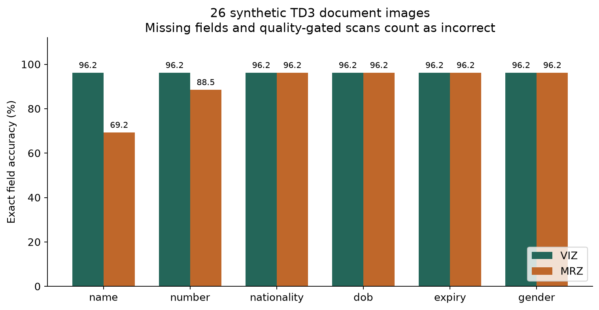
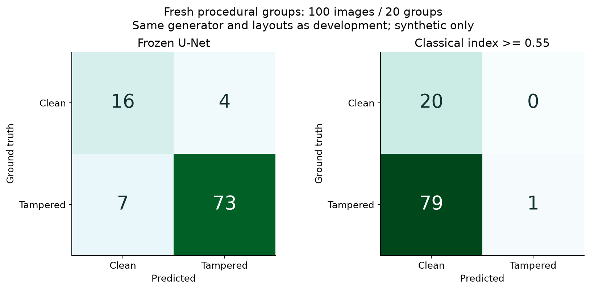
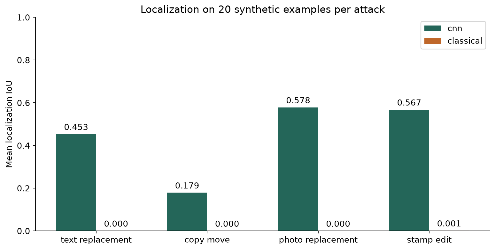
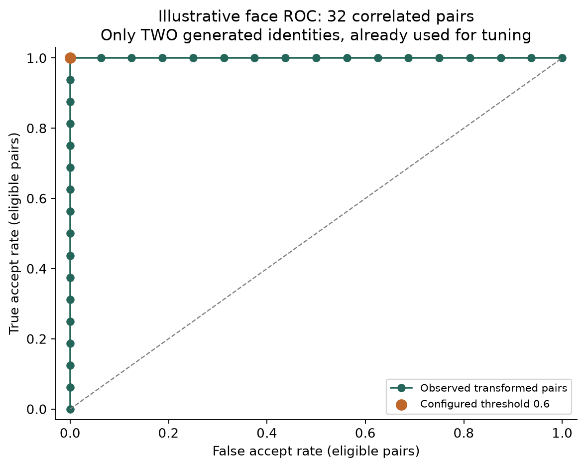
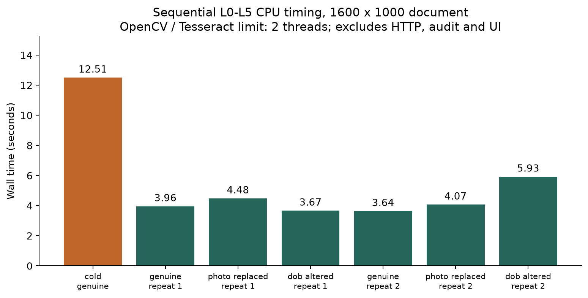

# Phase 6 measured evaluation

Synthetic development evidence only. No real-document or biometric accuracy claim.

## Protocol and sample boundaries

- OCR: 8 existing fixtures + 18 new values/conditions, same TD3 layout. TD1/TD2 parser tests are separate from image OCR metrics.
- Tampering: frozen checkpoint, 35 original held-out images replayed for reproducibility; 100 fresh images from 20 new source groups. Same generator/layouts/attack families.
- Face: 32 correlated transformed pairs from two generated identities already used for threshold selection. No independent biometric test cohort.
- Latency: one process-cold call + six sequential warm calls. Timing excludes fixture generation, HTTP, audit and UI. Two threads configured for OpenCV and Tesseract.

## OCR

| Channel | Exact correct / fields | Accuracy |
|---|---:|---:|
| VIZ | 150 / 156 | 96.15% |
| MRZ | 141 / 156 | 90.38% |

Valid-MRZ documents: 22/25 all-check pass (88.00%); parsed-only rate 91.67% on 24 documents.
Deliberately invalid MRZ: 1/1 flagged. Quality rescan count: 1.



## Tampering

| Cohort / detector | Precision | Recall | F1 | TN / FP / FN / TP |
|---|---:|---:|---:|---|
| fresh_groups_same_generator / cnn | 94.81% | 91.25% | 92.99% | 16 / 4 / 7 / 73 |
| fresh_groups_same_generator / classical | 100.00% | 1.25% | 2.47% | 20 / 0 / 79 / 1 |
| original_test_replay / cnn | 96.00% | 85.71% | 90.57% | 6 / 1 / 4 / 24 |
| original_test_replay / classical | 50.00% | 3.57% | 6.67% | 6 / 1 / 27 / 1 |

| Fresh attack | CNN flagged / 20 | CNN precision* | CNN recall | CNN F1* | CNN IoU | Classical IoU |
|---|---:|---:|---:|---:|---:|---:|
| text_replacement | 20 / 20 | 83.33% | 100.00% | 90.91% | 0.453 | 0.000 |
| copy_move | 13 / 20 | 76.47% | 65.00% | 70.27% | 0.179 | 0.000 |
| photo_replacement | 20 / 20 | 83.33% | 100.00% | 90.91% | 0.578 | 0.000 |
| stamp_edit | 20 / 20 | 83.33% | 100.00% | 90.91% | 0.567 | 0.001 |

*Per-attack precision/F1 compare each attack against the SAME 20 clean controls. Do not sum these overlapping cohorts. Image CNN flag = >=2% pixels at activation >=0.5; baseline flag = classical index >=0.55. Localization uses CNN activation >=0.5 and baseline uint8 map >=128. Clean-clean IoU is undefined.





## Face

Configured threshold: 0.6; eligible 32/32, undetermined 0. Illustrative FAR=0.00%, FRR=0.00% on eligible pairs only.
These values cannot establish a deployment threshold or FAR/FRR guarantee. Positive pairs share pixels and negative identities are already known. No population confidence interval is justified.



## System latency

Process-cold: 12.51s. Warm median: 4.01s; descriptive p95: 5.57s (n=6, linear interpolation).
Phase 5 browser measurements (92-124s cold, 22.50s warm) remain valid observations under different load/configuration. This controlled profile does not prove browser or checkpoint throughput.



## OCR errors (exact rows preserved in ocr.json)

- blurred (needs_rescan): viz.name: None vs 'EXAMPLE ALEX'; viz.number: None vs 'Z9000000'; viz.nationality: None vs 'UTO'; viz.dob: None vs '1988-04-12'; viz.expiry: None vs '2031-10-03'; viz.gender: None vs 'X'; mrz.name: None vs 'EXAMPLE ALEX'; mrz.number: None vs 'Z9000000'; mrz.nationality: None vs 'UTO'; mrz.dob: None vs '880412'; mrz.expiry: None vs '311003'; mrz.gender: None vs 'X'
- perspective (ok): mrz.number: '79000000' vs 'Z9000000'
- identity_0_genuine (ok): mrz.name: 'EXAMPLE ADA K' vs 'EXAMPLE ADA'
- identity_0_dob_altered (ok): mrz.name: 'EXAMPLE ADA K' vs 'EXAMPLE ADA'
- identity_1_genuine (ok): mrz.name: 'SAMPLE ROBIN K' vs 'SAMPLE ROBIN'
- identity_1_dob_altered (ok): mrz.name: 'SAMPLE ROBIN K' vs 'SAMPLE ROBIN'
- identity_2_jpeg_q70 (ok): mrz.name: 'MOCK SAM K' vs 'MOCK SAM'
- identity_3_genuine (ok): mrz.name: 'TEST ALEX K' vs 'TEST ALEX'
- identity_3_dob_altered (ok): mrz.name: 'TEST ALEX K' vs 'TEST ALEX'
- identity_3_jpeg_q70 (ok): mrz.number: '79100003' vs 'Z9100003'

## Interpretation and next engineering work

- A clean synthetic card can trigger classical signals because printed features and compression are not specific to tampering. PNG evaluation inputs lack ELA/JPEG-history evidence. Missing baseline detections are reported, not retuned away.
- Copy-move localization and misses should be judged per attack. Fixed procedural patterns are easier than unseen document layouts. The CNN remains excluded from risk scoring.
- MRZ check-digit pass measures consistency, not authentic issuance. DOB alteration can preserve a valid MRZ while disagreeing with VIZ.
- Photo-replacement demo tests disagreement with the supplied reference face; forensic localization may be inconclusive. It does not prove a detected splice.
- Next validation needs authorized data across devices/layouts, independent face identities/captures, threshold calibration on validation only, and a locked external test set.
- Production gaps: verified liveness, genuine stamp models/templates, chip trust validation, officer authentication, external audit anchoring, retention governance and container runtime validation.

## Reproduction

```powershell
.\.venv\Scripts\python.exe scripts/evaluate_phase6.py
.\.venv\Scripts\python.exe scripts/report_phase6.py
```

Raw section JSON includes sample rows, config/model/protocol hashes, environment versions and timestamps. Re-running overwrites reports, never trains or tunes models. Keep prior output directories when comparing runs.
